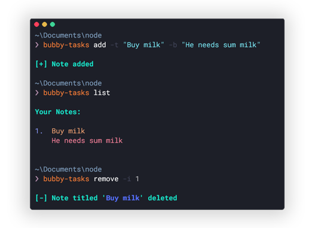

# bubby-tasks
A Command Line program made using NodeJS to store basic tasks

## Installation
```javascript
npm install -g bubby-tasks
```

## Usage

**Command Line**
```javascript
bubby-tasks [command]

Commands:
  bubby-tasks add     Add a new note
  bubby-tasks remove  Remove a note from existing notes
  bubby-tasks list    List all the notes
  bubby-tasks read    Read a note from existing notes

Options:
  -v, --version  Show version number                      [boolean]
  -h, --help     Show help                                [boolean]
  
  bubby-tasks [command] -h     Get more info regarding the command
  
Examples:
  bubby-tasks add -t "Buy milk" -b "Buy some milk before the week ends"    
  bubby-tasks remove -t "Buy milk"
  bubby-tasks list                                         List all tasks in a short form
  bubby-tasks read -i 1                                    Read a specific task without any truncation/ellipsis
```

## Screenshot

